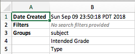
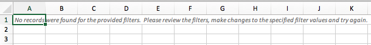
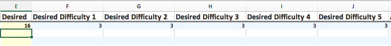
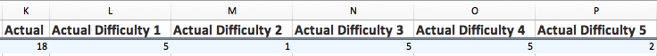
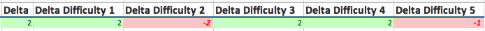

# Working with the Gap Report

[Go Back](../README.md)

This document describes how to work with the Gap Report: how to run it and how to work with the spreadsheet after it has been downloaded/saved.

## Execution
The Gap Report is executed by making a `POST` request to the Gap Report endpoint maintained within the Item Search Service.  The `POST` request can be made via any tool: `curl`, `wget` or [PostMan](https://www.getpostman.com/).

For additional details on the capabilities of and working with the Gap Report API, refer to [the Gap Report API page](https://github.com/SmarterApp/AP_IMRT_ItemSearchService/blob/feature/IAT-2095-docs/documentation/gap_report_api.md).

To run the Gap Report, take the following steps:
* Get a bearer token from OpenAM:

	```
	curl -i -X POST \
	   -H "Content-Type:application/x-www-form-urlencoded" \
	   -d "grant_type=password" \
	   -d "username=[a user account registered within openam]" \
	   -d "password=[password for user specified in 'username' field]" \
	   -d "client_id=[client id registered in OpenAM]" \
	   -d "client_secret=[client secret for client id]" \
	 'https://[OpenAM domain]/auth/oauth2/access_token?realm=%2Fsbac'
    ```

* The response will appear similar to this:

	```json
	{
	  "scope": "cn givenName mail sbacTenancyChain sbacUUID sn",
	  "expires_in": 35999,
	  "token_type": "Bearer",
	  "refresh_token": "[redacted]",
	  "access_token": "[redacted]"
	}
	```
	
* Compose a Gap Report request JSON payload.  Refer to [the Gap Report API page](https://github.com/SmarterApp/AP_IMRT_ItemSearchService/blob/develop/documentation/gap_report_api.md) for details on how ot compose a Gap Report request.

## Working with the Gap Report Spreadsheet
The Gap Report API returns an Excel spreadsheet with two worksheets:

### The Report Parameters Worksheet
This worksheet displays the date/time the report was created, the search filters and groups provided in the request.

* In the event no search filters were provided, the **Filters** row will provide an indicator that there were no search filters.  Figure 1 below shows an example:



**Figure 1**

### The Report Worksheet
This worksheet displays the content of the Gap Report.

* In the event the Gap Report request returned no data (e.g. the filters found zero rows), an indicator will be displayed on the **Report** worksheet.  Figure 2 shows an example:



**Figure 2**

#### Report Worksheet Columns
The **Report Worksheet** is split into five "regions".  Only the **Desired** column (highlighted in yellow) requires user input; the remaining cell values are calculated based on what the user types into a cell in the **Desired** column.

* **Groups:** These columns represent the fields the user requested to see the Item Difficulty Quintile counts grouped by.
  * These columns will appear in the order they were specified in the gap report request.  For example, if the `groups` for the gap report request was `[subject, intendedGrade, type]`, then the columns will be **Subject**, **Intended Grade**, **Item Type**.
  * Refer to the **Report Parameters** worksheet to determine the sequence in which the `groups` were sent
* **Desired** _**(Requires User Input):**_  The cells in this column are highlighted in yellow.  The user enters the _total number of desired items_ into this field.
* **Desired 1 - Desired 5:** This field is the calculation of the number entered into the **Desired** column divided by 5, dropping remainders.  Figure 3 shows an example of a user wanting to see 16 ESBR items for Grade 3 with a Primary Target of 2 in the ELA subject:



**Figure 3**

* **Actual:** This is the total number of items that satisfy the search filter criteria for the specified groups.  Figure 4 shows the total number of items in the itembank database for ESBR items for Grade 3 with a Primary Target of 2 in the ELA subject:
* **Actual 1 - Actual 5:** Shows the total number of items for that Item Difficulty Quintile level.  For example, the **Actual 2** column shows the number of items with an Item Difficulty Quintile of 2.

_**NOTE:**_  The actual counts do not include Stimulus or Tutorial items.



**Figure 4**

* **Delta:** This the difference between the desired number of items and the actual number of items.
  * If the difference is less than zero, the cell will be displayed in red font with a pink background, indicating the number of actual items does not meet the number of desired items.
  * If the difference is greater than or equal to zero, the cell will be displayed in green font with a light green background.  This indicates the number of actual items meets or exceeds the number of desired items.



